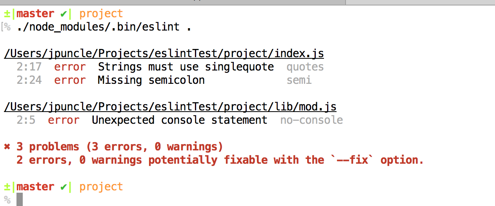

# 玩转 ESLint

[ESLint](https://eslint.org/) 是一个 JavaScript 代码质量工具，它可以帮助我们保持一致的代码风格，以及预先避免一些不必要的问题。而且 ESLint 是插件化的，你可以自定义规则。

基于 [athm-fe/create-autofe-app](https://github.com/athm-fe/create-autofe-app) 管理的项目就是使用 ESLint 来对 ES6+ 代码进行质量检查的。一开始使用的是 [Airbnb JavaScript](https://github.com/airbnb/javascript) 分享的 ESLint 配置，但是很多人反馈太过于严格，而且老的代码存在和这个代码风格严重不符的情况，导致需要进行大量的修改。

在我给大家解决这些问题时，发现大家对 ESLint 还不是很了解。因此就有了这篇文章，主要给大家介绍一下 ESLint 的用法，这样大家就可以轻松地 **“绕过”** 检查。😂


## ESLint 简介

ESlint 即可以全局安装，也可以局部安装，比较推荐局部安装：

```
$ npm install eslint --save-dev
```

默认情况下，ESLint 不会进行任何规则检查，可以先通过如下命令创建配置文件：

```
$ ./node_modules/.bin/eslint --init
```

*.eslintrc.js*

```javascript
module.exports = {
  "env": {
    "browser": true
  },
  "extends": "eslint:recommended",
  "rules": {
    "indent": ["error", 4],
    "linebreak-style": ["error", "unix"],
    "quotes": ["error", "single"],
    "semi": ["error", "always"]
  }
};
```

假设代码如下：

*index.js* and *lib/mod.js*

```javascript
var test = function () {
    console.log("Test")
};
```

接下来，就可以对代码进行质量检测：

```
$ ./node_modules/.bin/eslint .
```



从上图中可以看到，这两个文件加起来一共有三个错误，而且每一条错误都告诉我们详细的信息，比如
- 错误所在的位置 `2:17`
- 错误的级别 `error`
- 错误内容 `Strings must use singlequote`
- 对应的 ESLint 规则 `quotes`

全局使用是类似的：

```
$ npm install -g eslint
$ eslint --init
$ eslint yourfile.js
```


## 配置简介

前面说过，默认情况下，ESLint 不会进行任何规则检查，需要我们自己进行配置来添加规则。至于配置方式有如下几种

- 命令行配置，因为写起来不方便，维护性较差，所以**不建议用**。
- 注释配置，顾名思义，也就是在 JavaScript 文件内可以使用 JavaScript 注释添加配置，针对单个脚本文件的配置，可以**酌情使用**。
- 文件配置，可以给整个目录提供配置，**推荐使用**。

我们最常用的是文件配置方式，它支持 JavaScript 、 JSON 和 YAML 三种格式。需要注意的是，在同一个目录下，ESLint 会按照如下顺序依此查找配置文件，当存在多种格式的配置文件时，只取一个：
1. `.eslintrc.js`
2. `.eslintrc.yaml`
3. `.eslintrc.yml`
4. `.eslintrc.json`
5. `.eslintrc` （JSON or YAML ，已废弃）
6. `package.json` `eslintConfig`

通常，我们需要配置如下内容：
* `rules` 配置具体规则，以及每条规则的错误级别
* `env` 指定脚本的运行环境。每一个环境都定义了一组预设的全局变量
* `global` 额外配置的一些全局变量
* `parserOptions` 指定解析器选项
* `parser` 指定解析器


### 配置 `rules`

ESLint 内置了大量的[规则](https://eslint.org/docs/rules/)，你可以使用这些规则来制定你自己的代码风格。

我们来看一个简单配置，假设 `.eslintrc.js` 内容如下所示：

```javascript
module.exports = {
  "rules": {
    "indent": ["error", 4],
    "linebreak-style": ["error", "unix"],
    "quotes": ["error", "single"],
    "semi": ["error", "always"]
  }
};
```

在这个例子中，`"semi"` 和 `"quotes"` 是规则的名字，而他们的第一个值表示错误级别：
- `"off"` or `0` - 关闭规则
- `"warn"` or `1` - 警告，不影响进程 exitCode
- `"error"` or `2` - 报错，进程以 exitCode 为 1 退出

`"quotes": ["error", "single"]` 表示字符串应当使用单引号，否则报错，`"semi": ["error", "always"]` 表示必须使用分号，否则报错。

错误的级别是固定的，但是每一条规则的具体配置项各不相同，需要你自己去 [ESLint Rules](https://eslint.org/docs/rules/) 页面进行查看，下面是一个比较复杂的配置示例：

```json
{
  "rules": {
    "comma-spacing": ["error", {
      "before": false,
      "after": true
    }],
  }
}
```

这个配置表示逗号的前面不能时候空格，而其后面必须紧跟空格，否则就会报错。

#### 行内注释配置规则

配置规则

```javascript
/* eslint eqeqeq: "off", curly: "error" */
/* eslint quotes: ["error", "double"], curly: 2 */
```

#### 行内注释禁用规则

多行禁用所有规则

```javascript
/* eslint-disable */

alert('foo');
console.log('bar');
```

多行禁用若干规则

```javascript
/* eslint-disable no-alert, no-console */

alert('foo');
console.log('bar');
```

禁用后再启用规则

```javascript
/* eslint-disable no-alert, no-console */

alert('foo');
console.log('bar');

/* eslint-enable no-alert, no-console */

console.log('zoo');
```

单行禁用规则

```javascript
alert('foo'); // eslint-disable-line

// eslint-disable-next-line
alert('foo');

alert('foo'); // eslint-disable-line no-alert

// eslint-disable-next-line no-alert
alert('foo');

alert('foo'); // eslint-disable-line no-alert, quotes, semi

// eslint-disable-next-line no-alert, quotes, semi
alert('foo');
```


### 配置环境 `env`

指定脚本的运行环境，每一个环境都定义了一组预设的全局变量。ESLint 内置的环境有：
* `browser`
* `node`
* `commonjs`
* `es6` 这个会自动设置 `parseOptions.ecmaVersion` 为 6
* `worker`
* `amd`
* `mocha`
* `jasmine`
* `jquery`
* [更多](https://eslint.org/docs/user-guide/configuring#specifying-environments)

有如下两种配置方式：

*注释*
```javascript
`/* eslint-env browser, node */`
```

*文件*
```json
{
  "env": {
    "browser": true,
    "node": true
  }
}
```


### 配置全局变量 `global`

为什么需要配置全局变量呢，看如下代码：

```javascript
console.log(AHVP);
```

上面的代码使用了 `AHVP` ，但是我们没有定义这个变量，这个代码是有风险的。因此 ESLint 内置了规则 [`no-undef`](https://eslint.org/docs/rules/no-undef) 来警告我们使用了未定义的全局变量，提醒我们引入具体的 JavaScript 文件。

通过 `env` 可以配置 ESLint 预定义的全局变量，但是在日常开发中，我们经常会有这种额外的全局变量，这个时候我们可以通过 `global` 来进行配置。

有如下两种配置方式：

*注释*
```javascript
`/* global AHVP */`
`/* global var1, var2 */`
`/* global var1:false, var2:false */`
```

*文件*
```json
{
  "globals": {
    "var1": true,
    "var2": false
  }
}
```

另外，你可能注意到我们给 `var2` 设置了 `false` ，它表示不允许重新给 `var2` 赋值。向下面这样的代码会报错

```javascript
var2 = 'another value';
```

当然，这个需要开启规则 [`no-global-assign`](https://eslint.org/docs/rules/no-global-assign) 以提供支持。


### 指定解析器选项 `parserOptions`

ESLint 在检查规则之前，首先要能够解析 JavaScript 文件。默认情况下，ESLint 可以识别 ES5 语法。如果你想用 ESLint 来检查使用 ES6+ 的 JavaScript 文件，首先得让 ESLint 能够解析 ES6+ 语法。

这可以通过 `parserOptions` 来进行配置：
* `ecmaVersion` 值可以是 `3` ， `5` ， `6` / `2015` ， `7` / `2016` ， `8` / `2017` ，默认为 ES5 语法，可以修改这个开启 ES6+ 语法支持。
* `sourceType` 默认 `"script"` , 如果使用 ECMAScript 模块可修改为 `"module"`
* `ecmaFeatures` 开启一些额外的语言特性
  * `jsx` JSX 语法
  * `experimentalObjectRestSpread` Object Rest/Spread 语法

配置示例：

```json
{
  "parserOptions": {
    "ecmaVersion": 2017,
    "sourceType": "module",
    "ecmaFeatures": {
      "jsx": true,
      "experimentalObjectRestSpread": true
    }
  },
  "rules": {
    "semi": 2
  }
}
```

需要注意的是，仅仅配置 `{ "parserOptions": { "ecmaVersion": 6 } }` 是不够的，它告诉 ESLint 支持 ES6 语法检查，但是 ESLint 还是无法识别那些 ES6 新增的全局变量（比如，`Set`、`Map`、`WeakMap` 等），怎么办呢？答案很简单，配置 `{ "env": { "es6": true } }` 即可。


### 指定解析器 `parser`

ESLint 默认使用 [Espree](https://github.com/eslint/espree) 做为解析器，你可以使用其他的解析器，比如 [Babel-ESLint](https://www.npmjs.com/package/babel-eslint) 。

推荐使用 ESLint 默认的解析器，只有在 ESLint 还不支持的如下情况下才需要 `babel-eslint` ：
* 需要使用 Flow
* 需要使用一些 ECMAScript 的实验特性，而 ESLint 目前只支持到 ES2017 。


**注意：** 当使用自定义解析器时，为了使 ESLint 支持 ES6+ 语法，仍然需要配置 `parserOptions.ecmaVersion` 。


## 配置的优先级

前面，我们说过 ESLint 有三种配置方式，那这些配置的优先级是什么样的呢？看下面，优先级从高到底：

1. 行内配置
    1. /*eslint-disable*/ 和 /*eslint-enable*/
    2. /*global*/
    3. /*eslint*/
    4. /*eslint-env*/
2. 命令行选项：
    1. --global
    2. --rule
    3. --env
    4. -c、--config
3. 项目级配置：
    1. 与要检测的文件在同一目录下的 `.eslintrc.*` 或 `package.json` 文件
    2. 继续在父级目录寻找 `.eslintrc.*` 或 `package.json` 文件，直到文件根目录，或直到发现一个有 `"root": true` 配置的文件。（这个过程中排除 `~/.eslintrc` ）
    3. 当找不到任何配置文件时，则使用 `~/.eslintrc` 。

以上所有配置会合并，并且覆盖默认配置 `baseConfig` 。

举例说明：

```
home
├── .eslintrc <- [1]
└── user
    ├── .eslintrc <- [2] Always skipped if other configs present
    ├── projectA
    │   ├── .eslintrc  <- [3]
    │   ├── libA
    │   │   ├── .eslintrc <- [4]
    │   │   └── main.js
    │   └── libB
    │       ├── .eslintrc  <- [5] { "root": true }
    │       └── main.js
    └── projectB
        └── other.js
```

解释说明：
* `projectA/libA/main.js` 配置是 `[4]` + `[3]` + `[1]` 。
* `projectA/libB/main.js` 配置是 `[5]` 。
* 假如 `[1]` 不存在，则 `projectB/other.js` 使用 `[2]` 。


## 共享配置 Shareable Configs

前面讲了那么多配置，都是我们自己进行的。但是有人已经总结并写好了一份非常不错的配置，那我应当怎么使用呢。最笨的办法是 Copy 大法，不过我们还有更好的方式。ESLint 提供了配置扩展机制，别人写好的配置就叫共享配置。

共享配置约定 `eslint-config-xxx` 命名规则，自己开发的共享配置需要发布到 npm 上。你也可以直接使用别人开发好的配置，以 `eslint-config-airbnb` 为例：

首先需要下载对应插件：

```
npm install --save-dev eslint-config-airbnb
```

然后配置 `extends` 即可使用：

```json
{
  "extends": [
    "airbnb"
  ]
}
```

或者：

```json
{
  "extends": [
    "eslint-config-airbnb"
  ]
}
```


### 使用 `eslint:recommended`

其实， ESLint 官方内置了一个共享配置 `eslint:recommended` ，你可以基于它进行配置：

```javascript
module.exports = {
  "extends": "eslint:recommended",
  "rules": {
    // 添加 eslint:recommended 没有的规则
    "indent": ["error", 4],
    "linebreak-style": ["error", "unix"],
    "quotes": ["error", "double"],
    "semi": ["error", "always"],

    // 覆盖 eslint:recommended 的规则
    "comma-dangle": ["error", "always"],
    "no-cond-assign": ["error", "always"],

    // 禁用 eslint:recommended 的规则
    "no-console": "off",
  }
}
```

那 `eslint:recommended` 具体包括哪些规则呢，可以查看 [ESLint Rules](https://eslint.org/docs/rules/) 页面的规则列表，其中所有打 **“对勾”** 的规则就是 `eslint:recommended` 启用的规则。


## 插件 Plugins

插件是 ESLint 的强大之处，通过插件，我们可以识别新的语法，自定义更多的规则，还可以提供共享配置。

插件约定 `eslint-plugin-xxx` 命名规则，自己开发的插件需要发布到 npm 上。你也可以直接使用别人开发好的插件，以 `eslint-plugin-react` 为例：

首先需要下载对应插件：

```
npm install --save-dev eslint-plugin-react
```

然后配置 `plugins` 即可使用：

```json
{
  "plugins": [
    "react"
  ]
}
```

或者：

```json
{
  "plugins": [
    "eslint-plugin-react"
  ]
}
```


## Global or Local

由于 Node 的 `require` 函数，一个全局安装的 ESLint 只能使用全局安装的 Plugin 或 Shareable Config 。同样，一个本地安装的 ESLint 也只能使用本地安装的 Plugin 或 Shareable Config 。混合使用全局和本地的 Plugin 或 Shareable Config 是不允许的。

所以，项目目录之外的 `.eslintrc.*` 配置文件可能导致 `./node_modules/.bin/eslint .` 报错，比如找不到 `eslint-config-airbnb` 。配置 `"root": true` 可以解决这个问题。


## 同一目录下实现不同配置

利用前文的配置查找原理，我们可以实现不同目录下使用不同配置的需求。但是有时候我们需要一种更细粒度的配置，比如针对同一个目录下的不同文件采用不同的配置，这个时候就需要用到 `overrides` 了。

`overrides` 使用 Glob Patterns 来匹配文件，比如：
```json
{
  "rules": {
    "quotes": [2, "double"]
  },

  "overrides": [
    {
      "files": ["bin/*.js", "lib/*.js"],
      "excludedFiles": "*.test.js",
      "rules": {
        "quotes": [2, "single"]
      }
    }
  ]
}
```

**注意：** `overrides` 下不能配置 `extends` 、 `overrides` 和 `root` 。


## 用 `.eslintignore` 忽略某些文件

可以创建 `.eslintignore` 文件，不过只有项目根目录下（ `cwd` ）的该文件才有效。

ESLint 默认忽略 `/node_modules/*` 和 `/bower_components/*`

`.eslintignore` 配置举例，将忽略 `node_modules` `，bower_components` 以及 `build/` 目录下除了 `build/index.js` 的所有文件。

```
# /node_modules/* and /bower_components/* ignored by default

# Ignore built files except build/index.js
build/*
!build/index.js
```


## Creator 的 eslint

- `eslint-config-autofe-app` 自定义共享配置包，照搬了 `airbnb-base`，但是做了一些定制，比 `airbnb-base` 宽松，比 `eslint:recommended` 严格。
- 在项目根目录默认有一个 `.eslintrc.js` ，配置了 `root: true` 来防止受到外部 `.eslintrc.*` 的影响
- `eslint-loader` 与 webpack 集成。
- 只 Lint ES6 代码。


## 延伸阅读

- [Integrations](https://eslint.org/docs/user-guide/integrations)
  Editors(VSCode, Atom), Build tools(Webpack, Gulp), Source Control(Git), Testing(Mocha) and Others
- [Formatters](https://eslint.org/docs/user-guide/formatters/)
  stylish, checkstyle, html, json and so on.
- Developer Guide
  - Rules, 规则
  - Plugins, 插件, 提供 Rules + Environments + Processors + Config, 比如 `eslint-plugin-react`
  - Shareable Configs, 可共享配置包, 比如 `eslint-config-airbnb`
  - Custom Formatters, 自定义报告格式
- [awesome-eslint](https://github.com/dustinspecker/awesome-eslint)