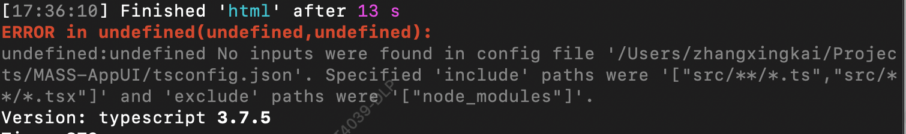

# TypeScript 使用

Creator 从 `autofe-scripts@1.3.4` 开始支持 TypeScript。

## 手动升级

如果你是使用 `npx create-autofe-app my-app` 创建新项目，可以自动略过该部分。

### 更新核心包

首先，更新现有包：

```
npm i --save-dev autofe-scripts@1.3.4
npm i --save-dev eslint@5.16.0
npm i --save-dev eslint-config-autofe-app@1.2.1 eslint-plugin-import@2.13.0
```

### 安装 Typescript 相关包

如果你需要 Typescript 支持，还需要安装如下包

```
npm i --save-dev typescript@3
npm i --save-dev @typescript-eslint/parser@2
npm i --save-dev @typescript-eslint/eslint-plugin@2
```

## 更新配置

`eslintrc.js` 需要添加对 TypeScript 的支持

```javascript
module.exports = {
  // ...
  extends: [
    'eslint-config-autofe-app',
    'eslint-config-autofe-app/typescript',
  ],
  // ...
};
```

另外，需要在项目根目录创建 `tsconfig.json`，具体内容请使用提前准备好的[配置](https://github.com/athm-fe/create-autofe-app/blob/master/packages/autofe-scripts/template/tsconfig.json)

## 开始使用

具体内容请移步 [TypeScript 使用](https://github.com/athm-fe/create-autofe-app/tree/master/packages/autofe-scripts/template#%E7%BC%96%E5%86%99-typescript)

## 问题

有可能你会遇到如下图中的报错：



这是因为 `tsconfig.json` 中 `include` 字段的配置要求你至少有一个 `.ts` 文件，解决办法很简单，在 `src` 目录下新建你的文件即可，比如 `hello.ts`