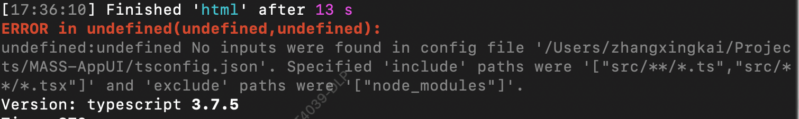

# Troubleshooting

This document covers some common issues and how to resolve them. You should always follow these steps before opening a new issue.

## TypeScript No inputs were found in config file

**该问题已经修复**

有可能你会遇到如下图中的报错：

这是因为 `tsconfig.json` 中 `include` 字段的配置要求你至少有一个 `.ts` 文件，解决办法很简单，在 `src` 目录下新建一个文件即可，比如 `hello.ts` 。